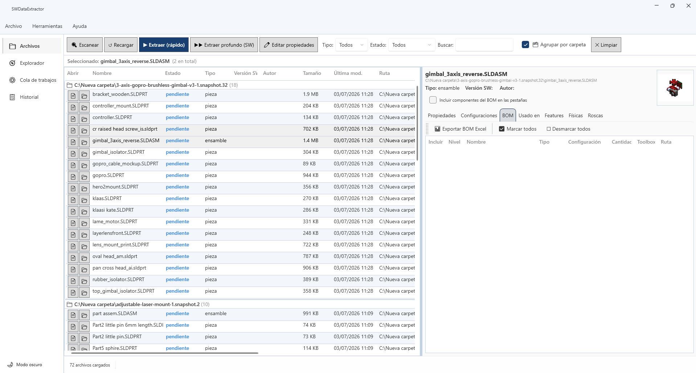
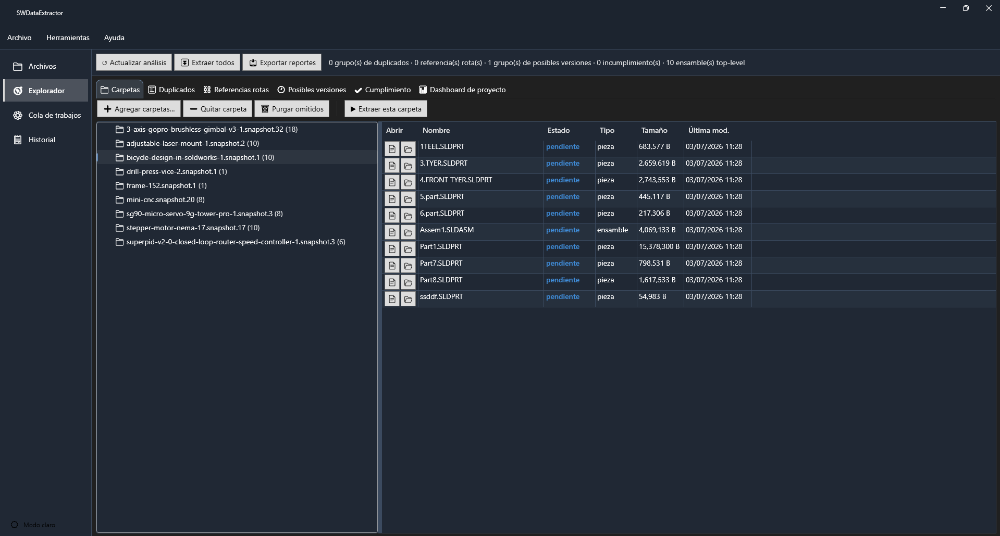
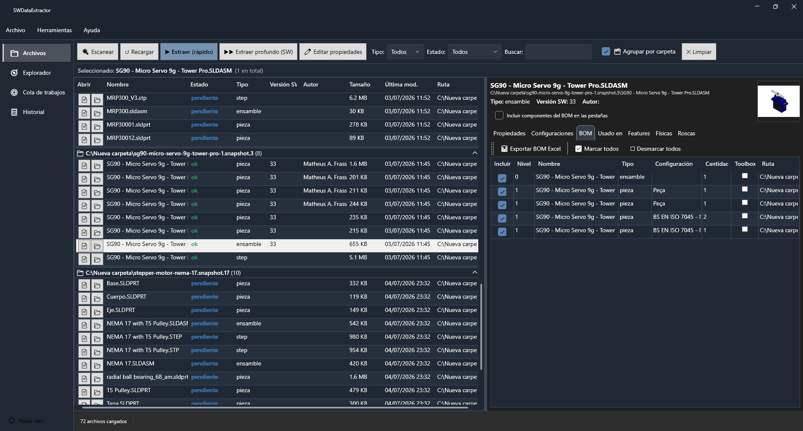
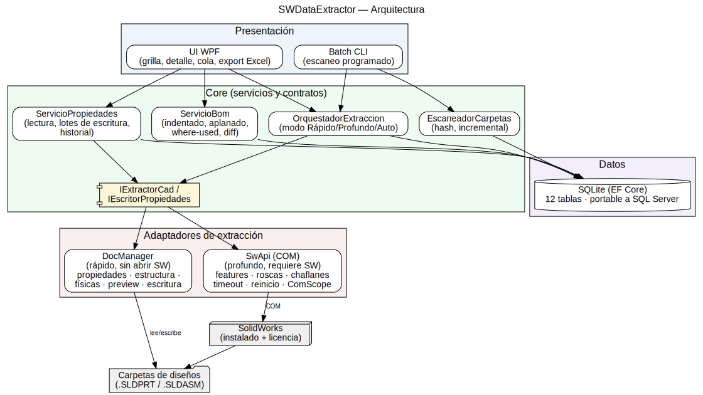

# SWDataExtractor (SW-ADMIN)

**Administrador y extractor de datos de proyectos SolidWorks** — indexa carpetas completas de
archivos CAD (piezas, ensambles y STEP) a una base de datos SQLite consultable, y sobre esos
datos funciona como centro de administración: explorador de proyectos, BOM, detección de
duplicados, referencias rotas, dashboard de salud y edición de propiedades por lotes con
auditoría.

> **Principio de diseño — "instala y funciona":** todo lo posible se hace **sin SolidWorks
> abierto y sin licencias adicionales**. Las funciones que sí requieren SolidWorks están
> marcadas como opcionales y nunca bloquean el flujo principal.

- **Plataforma:** Windows 10/11 x64 · WPF · .NET 10
- **Base de datos:** SQLite (portable a SQL Server para uso compartido)
- **Versión actual:** 1.1.0

---

## Capturas de pantalla

| Pantalla principal (grilla agrupada por carpeta + detalle) | Explorador de proyectos |
|---|---|
|  |  |

| Detalle con BOM y propiedades | Configuración |
|---|---|
|  |  |

*(Las imágenes viven en `docs/capturas/` — ver `docs/capturas/LEEME.txt` para regenerarlas.)*

---

## Características

### Extracción de datos (el corazón del sistema)

- **Escaneo recursivo e incremental** de carpetas: hash SHA-256 + fecha de modificación —
  solo se re-extrae lo que cambió. Los errores son **por archivo, nunca por lote**: un
  archivo corrupto se registra y el lote continúa.
- **Tres extractores detrás de una sola interfaz (`IExtractorCad`):**

  | Extractor | Requiere | Qué extrae |
  |---|---|---|
  | **DocManager** | Clave gratuita [Document Manager API](https://customerportal.solidworks.com) | Propiedades, configuraciones, estructura de ensambles, previews — rápido, sin abrir SW |
  | **StepHeader** | **Nada** | Encabezado ISO-10303 de `.stp/.step` (autor, organización, sistema CAD de origen, esquema AP203/AP214/AP242) **y el árbol completo de componentes internos (BOM)** |
  | **SwApi (COM)** | SolidWorks abierto | Features, roscas Hole Wizard, chaflanes, material, masa — extracción profunda |

- **Modos de usuario:** `Rápido` (sin SW), `Profundo` (con SW) y `Auto` (decide por archivo
  según su estado; nunca repite trabajo ya hecho).
- **Robustez COM:** timeout por archivo, reinicio programado de SolidWorks cada N archivos,
  apertura silenciosa (sin diálogos), liberación estricta de objetos COM.
- Archivos de una versión de SolidWorks más nueva que la instalada se marcan
  `version_no_soportada` — no rompen nada.

### Soporte STEP sin SolidWorks

Los `.stp/.step` son texto plano (ISO-10303-21) y se leen directamente:

- Propiedades `STEP_*`: nombre, fecha, autor, organización, preprocesador, sistema de
  origen (SolidWorks 2012–2024, Alibre, FreeCAD…), esquema AP.
- **BOM interno**: si el STEP es un ensamble, el árbol de componentes con cantidades se
  reconstruye desde la propia geometría (`NEXT_ASSEMBLY_USAGE_OCCURRENCE`) y se muestra en
  la pestaña BOM — sin abrir nada.
- Lo que STEP **no** puede dar (limitación del formato, no del programa): configuraciones,
  árbol de features/roscas y masa/material fiables.

### Administración de proyectos (todo sobre la BD, sin SW)

- **Explorador** de carpetas con conteos, extracción por lote ("Extraer esta carpeta" /
  "Extraer todos") con progreso y cancelación.
- **Duplicados exactos** por hash, con espacio recuperable calculado.
- **Referencias rotas** de ensambles y **posibles versiones** del mismo archivo.
- **Dashboard por proyecto**: ensamble raíz + BOM + salud general.
- **Miniaturas** vía el shell de Windows (funcionan sin licencia si SW está instalado).

### BOM y propiedades

- BOM **indentado y aplanado** desde la BD, con selección de filas, detección de
  tornillería Toolbox, **where-used** (¿en qué ensambles se usa esta pieza?) y **diff de
  BOM** entre dos fechas de extracción.
- **Escritura de propiedades por lotes** con diccionario estándar, diff previo a confirmar
  e **historial de auditoría** completo (quién, cuándo, valor anterior).
- **Exportación a Excel** de propiedades, BOM y reportes (ClosedXML).
- Las propiedades se distinguen **siempre** entre nivel documento y nivel configuración.

### UI y empresa

- WPF con temas **Plano técnico** (claro) y **Consola** (oscuro).
- Grilla filtrable (tipo/estado/texto) **agrupada por carpeta** con encabezados colapsables.
- Roles **Visualizador / Operador / Administrador** que ocultan funciones sensibles.
- Escaneo programado vía el ejecutable `Batch` (Worker Service).
- SQLite en modo WAL; cadena de conexión intercambiable a **SQL Server** para BD compartida.

---

## Arquitectura



Cuatro capas estrictas — solo `DocManager` y `SwApi` tocan DLLs de SolidWorks; **el resto
de la solución compila y corre sin SolidWorks instalado**:

```
UI (WPF) / Batch (CLI)          ← presentación y composition root
        ↓
Application                     ← servicios: orquestador, escaneador, BOM, propiedades, análisis
        ↓
IExtractorCad                   ← contrato único de extracción
   ↓         ↓         ↓
DocManager  StepHeader  SwApi   ← adaptadores intercambiables
        ↓
Data (EF Core + SQLite)         ← 13 tablas, migraciones aditivas, portable a SQL Server
```

```
proyecto/
├── src/
│   ├── Core/          Contratos, DTOs y enums (sin dependencias)
│   ├── Data/          AppDbContext, entidades, migraciones EF Core
│   ├── Application/   Servicios de negocio (orquestación, escaneo, BOM, análisis, licencias)
│   ├── DocManager/    Adaptador Document Manager API (requiere clave)
│   ├── SwApi/         Adaptador COM de SolidWorks (requiere SW abierto)
│   ├── Batch/         CLI / Worker Service para escaneo programado
│   └── UI/            Aplicación WPF (WPF-UI, MVVM con CommunityToolkit)
├── tests/Tests/       70 tests xUnit (unitarios + integración con SQLite en memoria)
├── docs/              DISENO.md (fuente de verdad), DECISIONES.md, ESTADO.md, AUDITORIA.md,
│                      diagramas Graphviz (.dot + .svg), capturas del README
└── herramientas/      publicar.ps1 (genera el paquete distribuible), LEEME de instalación
```

---

## Requisitos

**Para usar el programa (paquete distribuible):**
- Windows 10/11 x64. Nada más: los ejecutables son self-contained (no piden .NET).
- SolidWorks **solo** si quieres extracción profunda (features/roscas/masa) o miniaturas.

**Para compilar desde el código:**
- [.NET 10 SDK](https://dotnet.microsoft.com/)
- Las DLLs interop de SolidWorks (`SolidWorks.Interop.sldworks`, `SwDocumentMgr`) **no se
  incluyen en el repo** (son propietarias de Dassault). Se referencian desde la carpeta
  `api\redist` de tu instalación de SolidWorks; solo las necesitan los proyectos
  `DocManager` y `SwApi`.
- (Opcional) [Graphviz](https://graphviz.org/) para regenerar los diagramas SVG.

---

## Instalación y primeros pasos

### Opción A — Usuario final (recomendada)

1. Genera el paquete: `powershell -ExecutionPolicy Bypass -File herramientas\publicar.ps1`
   (crea `dist/SWDataExtractor-vX.Y.Z-win-x64.zip`, ~123 MB).
2. Descomprime el ZIP en cualquier carpeta **con permisos de escritura** (la BD y ajustes
   se crean junto al exe).
3. Ejecuta `SWDataExtractor.UI.exe`. La BD y las migraciones se aplican solas al arrancar.
4. Sigue el `LEEME-INSTALACION.txt` incluido (tiene también la guía de BD compartida).

### Opción B — Desde el código

```bash
git clone https://github.com/HdzDaniel7/SW-ADMIN-App.git
cd SW-ADMIN-App
dotnet build            # compila toda la solución
dotnet test tests/Tests # 70/70 en verde
dotnet run --project src/UI
```

### Flujo típico de trabajo

1. **Herramientas → Configuración → Carpetas**: agrega las carpetas raíz de tus proyectos.
   Al guardar se dispara un escaneo automático.
2. En la pestaña **Archivos** verás todo indexado, agrupado por carpeta. Selecciona y usa
   **▶ Extraer (rápido)** — o ve al **Explorador** y usa "⏬ Extraer todos".
3. Haz clic en cualquier archivo: el panel de detalle muestra propiedades, configuraciones,
   BOM, where-used, features y físicas (según lo extraído).
4. Explora **Duplicados**, **Referencias rotas** y el **Dashboard** por proyecto.
5. ¿Propiedades desordenadas? Define tu diccionario estándar y usa **✏ Editar propiedades**
   por lotes — con diff previo y todo auditado.

---

## Configuración

Dos niveles: `appsettings.json` (junto al exe) como base, y la ventana **Configuración**
de la UI, que guarda en BD y tiene prioridad.

| Clave | Qué controla | Default |
|---|---|---|
| `Extraccion:CarpetasRaiz` | Carpetas a escanear (mejor configurarlas desde la UI) | `[]` |
| `Extraccion:ExtensionesIncluidas` | Tipos de archivo a indexar | `.sldprt .sldasm .stp .step` |
| `Extraccion:PatronesExcluidos` | Globs a ignorar | `~$*`, `*\backup\*` |
| `Extraccion:TimeoutPorArchivoSegundos` | Corte por archivo en extracción | `300` |
| `Extraccion:ReiniciarSwCadaNArchivos` | Higiene COM en lotes grandes | `50` |
| `BaseDatos:CadenaConexion` | SQLite local o SQL Server compartido | `Data Source=swdata.db` |
| `Funcionalidades:*` | Flags para ocultar módulos completos en la UI | todo `true` |

### Clave del Document Manager (opcional pero recomendada)

Habilita el modo Rápido *sin* SolidWorks abierto. Es **gratuita** con suscripción activa:
solicítala en el portal de clientes de SolidWorks (API Support). Luego pégala en
**Configuración → Clave DocManager** — se guarda **cifrada con DPAPI** en la BD, nunca en
texto plano ni en archivos versionados. Sin clave, el programa sigue funcionando: STEP se
extrae siempre, y el modo Rápido usa SolidWorks abierto como sustituto liviano.

---

## Consejos

- **¿Sin licencia DocManager y sin SW abierto?** Igual puedes indexar todo (nombres, hashes,
  duplicados, versiones) y extraer los STEP completos. La extracción de `.sldprt/.sldasm`
  quedará pendiente hasta que abras SolidWorks o configures la clave.
- **Lotes grandes:** usa el modo `Auto` — combina lo mejor de ambos y no repite trabajo.
  El hash SHA-256 garantiza que re-escanear una carpeta enorme cueste segundos.
- **BD compartida en equipo:** apunta `CadenaConexion` a SQL Server (el SQL es portable);
  un solo equipo extrae y todos consultan.
- **El archivo se movió de carpeta:** hoy se re-indexa como nuevo (la actualización de ruta
  por hash está en el roadmap, fase 7b).
- **Los ZIP de `dist/` no van a git** (128 MB > límite de 100 MB de GitHub): publícalos como
  *Release* en GitHub si quieres distribuirlos desde el repo.
- **Toma el detalle de un ensamble con "Incluir componentes del BOM"** para ver las
  propiedades de todas sus piezas juntas — y exportarlas a un solo Excel.

---

## Desarrollo

- **Fuente de verdad del diseño:** [docs/DISENO.md](docs/DISENO.md) (esquema de BD,
  interfaces, criterios de aceptación por fase).
- **Decisiones de arquitectura:** [docs/DECISIONES.md](docs/DECISIONES.md) (23 entradas
  fechadas con contexto y alternativas descartadas).
- **Estado vivo del proyecto:** [docs/ESTADO.md](docs/ESTADO.md).
- **Auditorías de fase:** [docs/AUDITORIA.md](docs/AUDITORIA.md) (protocolo + hallazgos).
- **Tests:** `dotnet test tests/Tests` — xUnit, SQLite en memoria, sin dependencia de SW.
- Convenciones: código e identificadores en inglés; comentarios, logs, UI y docs en español.
  Commits en español con [Conventional Commits](https://www.conventionalcommits.org/es)
  (`feat:`, `fix:`, `docs:`…).

### Roadmap

- **7b** — copiar/mover archivos con aviso de referencias; actualizar ruta por hash al
  detectar archivos movidos.
- **7c** — Pack and Go real vía SwApi (en evaluación: requiere SW abierto).
- Validaciones pendientes con SolidWorks real: lote de tortura, timeout de COM colgado,
  detección Toolbox real.

---

## Notas de la versión 1.1.0

- ✨ Extracción de `.stp/.step` **sin SolidWorks**: propiedades del encabezado + **BOM
  interno** del ensamble en la pestaña BOM.
- ✨ Grilla principal agrupada por carpeta (encabezados colapsables, activada por defecto).
- 🐛 El panel de detalle no se refrescaba tras extraer; corregido.
- 🐛 Encabezados STEP con comentarios `/*…*/` (Alibre, FreeCAD) se parsean correctamente.

*Este software no está afiliado a Dassault Systèmes. SolidWorks es marca registrada de
Dassault Systèmes.*
